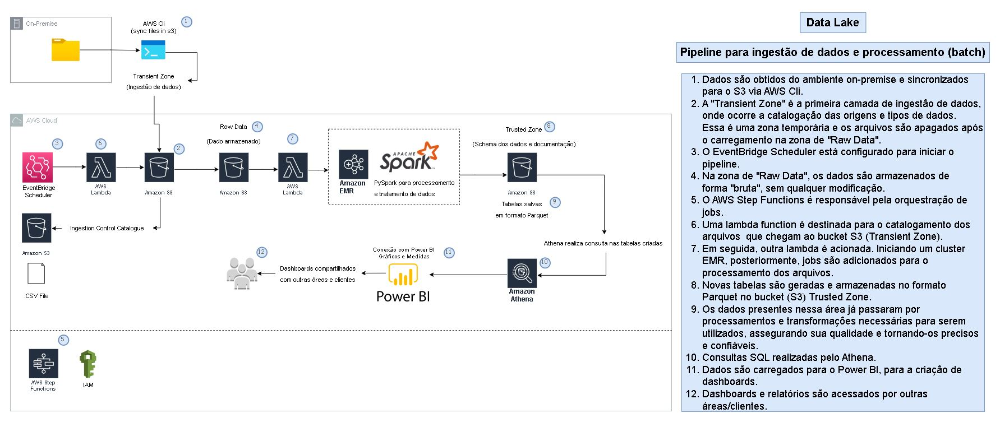
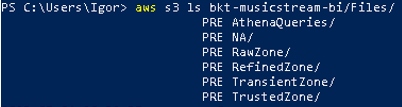
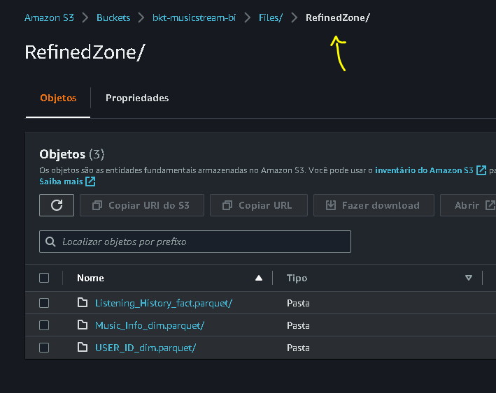

---
jupyter:
  kernelspec:
    display_name: Python 3
    language: python
    name: python3
  language_info:
    codemirror_mode:
      name: ipython
      version: 3
    file_extension: .py
    mimetype: text/x-python
    name: python
    nbconvert_exporter: python
    pygments_lexer: ipython3
    version: 3.9.6
  nbformat: 4
  nbformat_minor: 5
---

::: {#1c3edcf2 .cell .markdown}
# Projeto de BI em PySpark
:::

::: {#afadb412 .cell .raw}
```{=ipynb}
Este notebook contempla toda a exploração e criação física dos processos necessários para um projeto de Engenharia de Dados (ingestão de dados) em processamento batch para um Data Lake.

Etapas:
- Análise dos dados
- Entendimento de "erros" de digitação e/ou linhas/colunas duplicadas
- Correção e conversão dos arquivos para formato Parquet e envio para outro bucket (Verificar Scripts nas pasta Raw Zone, Trusted Zone)
- Criação de diagrama com as tabelas e relacionamentos existentes
- Fluxograma do processo de ingestão de dados até entrega de dashboards para a área de BI e clientes.
- Dashboards foram desenvolvidos em Power BI utilizando o conector Athena.

Itens adicionais:
- Codigos para automação estão presentes nas pastas (Lambdas e Scripts)
- Mapeamento das fontes de dados (Pasta 3)
- Criação das camadas para ingestão e tratamento dos dados (4, 5 e 6)
- Exploração e entendimento das fontes de dados (número de linhas, colunas, tipo de arquivo)
- Tratamento para retirada de linhas com erros de digitação e/ou duplicadas
- Schema (tipagem das colunas)
- Metadados (Pasta 8)
- Tabelas Athena (Pasta 9)
```
:::

::: {#c1ad4a96 .cell .markdown}
# Arquitetura Cloud (AWS)
:::

::: {#83c79aad .cell .markdown}

:::

::: {#759bab1a .cell .markdown}
:::

::: {.cell .markdown}
# Armazenamento em um novo bucket S3 (Refined Zone - formato Parquet)
:::

::: {#6b8c4880 .cell .markdown}
# Diagrama
:::

::: {#72fb32bd .cell .markdown}
Conforme o diagrama proposto, este projeto utilizará 3 tabelas

-   1 tabela fato - Todos os registros de músicas escutadas por usuário
-   1 tabela dimensão - Todos os usuários
-   1 tabela dimensão - Todas as musicas/artista

Diagrama feito no Draw.io
:::

::: {#a1337664 .cell .markdown}

:::

::: {#89c5a417 .cell .markdown}
# Dashboard desenvolvido para a área de BI
:::

::: {#a80eda77 .cell .markdown}

:::

::: {#9643e78b .cell .markdown}

:::

::: {#1e2ff9df .cell .markdown}
# Principais Pontos do Dashboard:
:::

::: {#609aa1b8 .cell .markdown}
-   Conexão realizada via Athena
-   Dados históricos de streaming para o ano de 2020
-   Ideia principal:
    -   Apresentar o comportamento de streamings ao longo do ano de
        2020, mapeando o principal gênero dos usuários.
    -   Quais artistas, álbuns e data de lançamento de discos e singles
        apresentaram maiores resultados.
    -   Fornecer um dashboard para entendimento macro das informações
        históricas, e futuramente desenvolver estudos específicos, de
        acordo com a necessidade da empresa.

O arquivo PBIX para edição do dashboard está diponível no GitHub.
:::

::: {#9be68f49 .cell .markdown}
# Principais Pontos do README

Análise exploratória para verificar inconsistências e erros prensentes
nas tabelas. Os códigos para automação estão separados em pastas no
github para o Data Lake:

-   Scripts para lambda functions
-   Scripts para leitura de dados por camadas (transient, raw, trusted)
-   Script para Metadados (Data Lineage)
:::

::: {#609137e5 .cell .markdown}
# Arquivos sincronizados de um desktop e salvos em um bucket (S3) no formato .csv {#arquivos-sincronizados-de-um-desktop-e-salvos-em-um-bucket-s3-no-formato-csv}
:::

::: {#1535642a .cell .raw}
```{=ipynb}
Endereco bkt origem: s3://bkt-musicstream-bi/Files/TransientZone/
Endereco bkt destino: s3://bkt-musicstream-bi/Files/RawZone/
```
:::

::: {#2ca14c91 .cell .markdown}

:::

::: {#2676d80a .cell .markdown}
# Tabelas Criadas
:::

::: {#1b7e4adb .cell .raw}
```{=ipynb}
- music_info_unique (formato parquet)
- user_listening_history_raw (formato parquet)
- users (formato parquet)
```
:::

::: {#53f6d63b .cell .markdown}
# AWS CLI Commands (Powershell)
:::

::: {#ad32b952 .cell .markdown}
## Enviar arquivos para Transient Zone (camada de ingestão de dados)
:::

::: {#42f9641b .cell .markdown}
###### Listar Buckets
:::

::: {#73c5d3e4 .cell .raw}
```{=ipynb}
aws s3 ls
```
:::

::: {#b5c3534e .cell .markdown}

:::

::: {#1f9df4f2 .cell .markdown}
##### Listar arquivos no bucket Transient Zone
:::

::: {#107d2d15 .cell .raw}
```{=ipynb}
#Listar pastas dentro da pasta S3 Transient
aws s3 ls bkt-musicstream-bi/Files/TransientZone/
```
:::

::: {#81fd649d .cell .markdown}

:::

::: {#de3cc021 .cell .markdown}
##### Enviar arquivos para o bucket Transient Zone
:::

::: {#ae614ceb .cell .raw}
```{=ipynb}
Comando: --recursive (todos os itens)
```
:::

::: {#9df5b296 .cell .raw}
```{=ipynb}
aws s3 cp c:\Users\YourUser\CaminhoPasta\ s3://bkt-musicstream-bi/Files/TransientZone/ --recursive
```
:::

::: {#4a3532f1 .cell .markdown}
# Processos do Notebook
:::

::: {#8ec055f3 .cell .raw}
```{=ipynb}
- Nesta parte serão apresentados códigos para a exploração e criação das tabelas.
- Os scripts para criação e controle do data lake estão presentes no outro notebook.
```
:::

::: {#a28f7807 .cell .markdown}
#### Iniciar sessão Spark
:::

::: {#a6a82bf9 .cell .code execution_count="51" trusted="false"}
``` python
#!/usr/bin/env python
# coding: utf-8
```

::: {.output .display_data}
``` json
{"model_id":"","version_major":2,"version_minor":0}
```
:::
:::

::: {#003c2fc3 .cell .code execution_count="52" trusted="false"}
``` python
from pyspark.sql import SparkSession

spark = SparkSession.builder.getOrCreate()
```

::: {.output .display_data}
``` json
{"model_id":"","version_major":2,"version_minor":0}
```
:::
:::

::: {#43612c0e .cell .code execution_count="53" trusted="false"}
``` python
import os
import sys
import pytz
import numpy as np
import datetime
from pyspark.sql import SparkSession
from pyspark.sql import SQLContext
from pyspark.sql.functions import col, udf, lpad, translate
from datetime import datetime 
from datetime import timedelta
from datetime import date
from dateutil.relativedelta import relativedelta
from pyspark.sql.types import *
from pyspark.sql.functions import count, avg
```

::: {.output .display_data}
``` json
{"model_id":"","version_major":2,"version_minor":0}
```
:::
:::

::: {#5ecb957c .cell .code execution_count="15" trusted="false"}
``` python
agora = datetime.now(pytz.timezone('America/Sao_Paulo'))
dthproc = agora.strftime("%Y%m%d%H%M%S")
```

::: {.output .display_data}
``` json
{"model_id":"","version_major":2,"version_minor":0}
```
:::
:::

::: {#73237a26 .cell .code execution_count="16" trusted="false"}
``` python
spark = SparkSession.builder.appName("t_Music_Info").getOrCreate()
sqlContext = SQLContext(spark.sparkContext)
```

::: {.output .display_data}
``` json
{"model_id":"","version_major":2,"version_minor":0}
```
:::
:::

::: {#96aea2ac .cell .code execution_count="17" trusted="false"}
``` python
file = "Music_Info.csv"
```

::: {.output .display_data}
``` json
{"model_id":"","version_major":2,"version_minor":0}
```
:::
:::

::: {#4677c9c4 .cell .code execution_count="18" trusted="false"}
``` python
ts_file_generation = file.split("-")[-1].replace(".csv", "") + "00"
print(ts_file_generation)
```

::: {.output .display_data}
``` json
{"model_id":"","version_major":2,"version_minor":0}
```
:::

::: {.output .stream .stdout}
    Music_Info00
:::
:::

::: {#41c19bab .cell .code execution_count="19" trusted="false"}
``` python
bucket_raw = "bkt-musicstream-bi/Files/RawZone"
bucket_ingestion = "bkt-musicstream-bi/Files/TransientZone"
bucket_control = "bkt-musicstream-bi/Files/Control"
bucket_trusted = "bkt-musicstream-bi/Files/NA/NATrusted"
```

::: {.output .display_data}
``` json
{"model_id":"","version_major":2,"version_minor":0}
```
:::
:::

::: {#306d5080 .cell .code execution_count="20" trusted="false"}
``` python
output_lake = "Music_Catalog"
```

::: {.output .display_data}
``` json
{"model_id":"","version_major":2,"version_minor":0}
```
:::
:::

::: {#63816064 .cell .code execution_count="21" trusted="false"}
``` python
full_path_ingestion = "s3://{bkt}/{file}".format(bkt=bucket_ingestion, file=file)
print(full_path_ingestion)
```

::: {.output .display_data}
``` json
{"model_id":"","version_major":2,"version_minor":0}
```
:::

::: {.output .stream .stdout}
    s3://bkt-musicstream-bi/Files/TransientZone/Music_Info.csv
:::
:::

::: {#e8e290e0 .cell .raw}
```{=ipynb}
s3://bkt-musicstream-bi/Files/TransientZone/Music_Info.csv
```
:::

::: {#a36c161d .cell .raw}
```{=ipynb}
s3://bkt-musicstream-bi/Files/TransientZone/Music_Info.csv
```
:::

::: {#91ed83cb .cell .code execution_count="22" trusted="false"}
``` python
#music_info_t = spark.read.csv(full_path_ingestion, sep=",", header=True).
```

::: {.output .display_data}
``` json
{"model_id":"","version_major":2,"version_minor":0}
```
:::
:::

::: {#a3c88c15 .cell .code execution_count="23" scrolled="false" trusted="false"}
``` python
pouso = spark.read.format(
    "com.databricks.spark.csv").option(
    "header", "true").option(
    "enconding", "ISO-8859-1").option(
    "enconding", "UTF-8").option(
    "inferSchema", "false").option(
    "delimiter", ",").load(
    full_path_ingestion)
pouso.registerTempTable("pouso")
pouso.cache()
qtd=pouso.count() 
print('registros ingestao de dados:', qtd)
```

::: {.output .display_data}
``` json
{"model_id":"","version_major":2,"version_minor":0}
```
:::

::: {.output .stream .stdout}
    registros ingestao de dados: 50683
:::
:::

::: {#b68cc401 .cell .markdown}
##### Listando Colunas
:::

::: {#d3aceda4 .cell .code execution_count="24" trusted="false"}
``` python
for col in pouso.columns:
    print(col + ",")
```

::: {.output .display_data}
``` json
{"model_id":"","version_major":2,"version_minor":0}
```
:::

::: {.output .stream .stdout}
    track_id,
    name,
    artist,
    spotify_preview_url,
    spotify_id,
    tags,
    genre,
    year,
    duration_ms,
    danceability,
    energy,
    key,
    loudness,
    mode,
    speechiness,
    acousticness,
    instrumentalness,
    liveness,
    valence,
    tempo,
    time_signature,
:::
:::

::: {#4c81d252 .cell .markdown}
O particionamento da tabela lake foi feito pensado no consumo do dado,
ou seja, faz mais sentido que a informação seja consumida e armazenada
por data de lançamento do álbum.
:::

::: {#42c5253a .cell .code execution_count="38" trusted="false"}
``` python
lake = spark.sql(
    """ 
        select
            -- padrao para todas as tabelas
            
            --int(date_format(created_at, 'yyyyMMMM')) as ref,
            --int(date_format(created_at, 'yyyyMMMM')) as ref_partition,
            
            --{tsfileger} as ts_file_generation,
            --{tsfileger} as ts_file_generation_partition,
            
            {pdthproc} as ts_proc,
            {pdthproc} as ts_proc_partition,
            
            year as ref_year,
            year as ref_year_partition,
            
            -- campos do arquivos
            
            track_id,
            name,
            artist,
            spotify_preview_url,
            spotify_id,
            tags,
            genre,
            year,
            duration_ms,
            danceability,
            energy,
            key,
            loudness,
            mode,
            speechiness,
            acousticness,
            instrumentalness,
            liveness,
            valence,
            tempo,
            time_signature
            
        from
            pouso
    
    """.format(tsfileger=ts_file_generation, pdthproc=dthproc))
lake.registerTempTable("lake")
lake.cache()
lake.count()
```

::: {.output .display_data}
``` json
{"model_id":"","version_major":2,"version_minor":0}
```
:::

::: {.output .stream .stdout}
    50683
:::
:::

::: {#dc6f3a97 .cell .code execution_count="39" trusted="false"}
``` python
lake.columns
```

::: {.output .display_data}
``` json
{"model_id":"","version_major":2,"version_minor":0}
```
:::

::: {.output .stream .stdout}
    ['ts_proc', 'ts_proc_partition', 'ref_year', 'ref_year_partition', 'track_id', 'name', 'artist', 'spotify_preview_url', 'spotify_id', 'tags', 'genre', 'year', 'duration_ms', 'danceability', 'energy', 'key', 'loudness', 'mode', 'speechiness', 'acousticness', 'instrumentalness', 'liveness', 'valence', 'tempo', 'time_signature']
:::
:::

::: {#c1fa18ca .cell .code execution_count="40" trusted="false"}
``` python
print("s3://bkt-musicstream-bi/Files/RawZone/Music_Catalog/")
```

::: {.output .display_data}
``` json
{"model_id":"","version_major":2,"version_minor":0}
```
:::

::: {.output .stream .stdout}
    s3://bkt-musicstream-bi/Files/RawZone/Music_Catalog/
:::
:::

::: {#dc86ab98 .cell .code execution_count="41" trusted="false"}
``` python
path_raw = os.path.join('s3://', bucket_raw, output_lake)
print(path_raw)

lake.coalesce(1).write. \
partitionBy("ref_year_partition"). \
parquet(path_raw, mode='overwrite')
```

::: {.output .display_data}
``` json
{"model_id":"","version_major":2,"version_minor":0}
```
:::

::: {.output .stream .stdout}
    s3://bkt-musicstream-bi/Files/RawZone/Music_Catalog
:::
:::

::: {#8e79ea44 .cell .code execution_count="42" trusted="false"}
``` python
varDataFile = output_lake
```

::: {.output .display_data}
``` json
{"model_id":"","version_major":2,"version_minor":0}
```
:::
:::

::: {#740cc28a .cell .code execution_count="44" trusted="false"}
``` python
controle = spark.sql(
        """
            select 
                '{tb}' as name_file,
                '{tb}' as name_file_partition,
                
                --ref,
                --ref_partition,
                
                ts_proc,
                ts_proc_partition,
                
                count(*) as qtd_registros
            
            from
                lake as a
            group by
                1, 2, 3, 4
            order by
                1, 2, 3, 4
        """.format(tb=varDataFile))
```

::: {.output .display_data}
``` json
{"model_id":"","version_major":2,"version_minor":0}
```
:::
:::

::: {#cadbacf3 .cell .code execution_count="45" trusted="false"}
``` python
controle.show(10)
```

::: {.output .display_data}
``` json
{"model_id":"","version_major":2,"version_minor":0}
```
:::

::: {.output .stream .stdout}
    +-------------+-------------------+--------------+-----------------+-------------+
    |    name_file|name_file_partition|       ts_proc|ts_proc_partition|qtd_registros|
    +-------------+-------------------+--------------+-----------------+-------------+
    |Music_Catalog|      Music_Catalog|20230726205238|   20230726205238|        50683|
    +-------------+-------------------+--------------+-----------------+-------------+
:::
:::

::: {#15c4405f .cell .code execution_count="46" trusted="false"}
``` python
controle.registerTempTable("controle")
controle.cache()
qtd = controle.count()
```

::: {.output .display_data}
``` json
{"model_id":"","version_major":2,"version_minor":0}
```
:::
:::

::: {#78b9569f .cell .code execution_count="47" trusted="false"}
``` python
controle.show(truncate=False)
```

::: {.output .display_data}
``` json
{"model_id":"","version_major":2,"version_minor":0}
```
:::

::: {.output .stream .stdout}
    +-------------+-------------------+--------------+-----------------+-------------+
    |name_file    |name_file_partition|ts_proc       |ts_proc_partition|qtd_registros|
    +-------------+-------------------+--------------+-----------------+-------------+
    |Music_Catalog|Music_Catalog      |20230726205238|20230726205238   |50683        |
    +-------------+-------------------+--------------+-----------------+-------------+
:::
:::

::: {#78777d19 .cell .code execution_count="108" trusted="false"}
``` python
path_control = os.path.join("s3://", bucket_control, "tb_0001_controle_processamento_raw")
print(path_control)
controle.coalesce(1).write. \
parquet(path_control, mode="append")
```

::: {.output .display_data}
``` json
{"model_id":"","version_major":2,"version_minor":0}
```
:::

::: {.output .stream .stdout}
    s3://bkt-musicstream-bi/Files/Control/tb_0001_controle_processamento_raw
:::
:::

::: {#1e3f45e0 .cell .markdown}
# Preparação Dados
:::

::: {#6cef0275 .cell .markdown}
# S3 Datasets
:::

::: {#54683815 .cell .code execution_count="9" trusted="false"}
``` python
music_info_raw = spark.read.csv("s3://bkt-musicstream-bi/Files/RawZone/Music_Info.csv", sep=",", header=True)
```

::: {.output .display_data}
``` json
{"model_id":"","version_major":2,"version_minor":0}
```
:::
:::

::: {#96fdda28 .cell .code execution_count="10" trusted="false"}
``` python
user_listening_history_raw = spark.read.csv("s3://bkt-musicstream-bi/Files/RawZone/User_Listening_History.csv", sep=",", header=True)
```

::: {.output .display_data}
``` json
{"model_id":"","version_major":2,"version_minor":0}
```
:::
:::

::: {#d822d5fe .cell .markdown}
# Num Linhas/Colunas (Shape)
:::

::: {#69d6ed76 .cell .code execution_count="15" trusted="false"}
``` python
#numero colunas e linhas
num_rows = music_info_raw.count()
num_cols = len(music_info_raw.columns)
```

::: {.output .display_data}
``` json
{"model_id":"","version_major":2,"version_minor":0}
```
:::
:::

::: {#78a4d5d8 .cell .code execution_count="16" scrolled="true" trusted="false"}
``` python
print('Shape: ({}, {})'.format(num_rows, num_cols))
```

::: {.output .display_data}
``` json
{"model_id":"","version_major":2,"version_minor":0}
```
:::

::: {.output .stream .stdout}
    Shape: (50683, 21)
:::
:::

::: {#039913bc .cell .code execution_count="17" trusted="false"}
``` python
#numero colunas e linhas
num_rows1 = user_listening_history_raw.count()
num_cols1 = len(user_listening_history_raw.columns)
```

::: {.output .display_data}
``` json
{"model_id":"","version_major":2,"version_minor":0}
```
:::
:::

::: {#19857bc6 .cell .code execution_count="18" trusted="false"}
``` python
print('Shape: ({}, {})'.format(num_rows1, num_cols1))
```

::: {.output .display_data}
``` json
{"model_id":"","version_major":2,"version_minor":0}
```
:::

::: {.output .stream .stdout}
    Shape: (9711301, 3)
:::
:::

::: {#9f947431 .cell .markdown}
# Desc Colunas (Columns description)
:::

::: {#28ba5622 .cell .code execution_count="19" trusted="false"}
``` python
#colunas
music_info_raw.columns
```

::: {.output .display_data}
``` json
{"model_id":"","version_major":2,"version_minor":0}
```
:::

::: {.output .stream .stdout}
    ['track_id', 'name', 'artist', 'spotify_preview_url', 'spotify_id', 'tags', 'genre', 'year', 'duration_ms', 'danceability', 'energy', 'key', 'loudness', 'mode', 'speechiness', 'acousticness', 'instrumentalness', 'liveness', 'valence', 'tempo', 'time_signature']
:::
:::

::: {#20852292 .cell .code execution_count="20" trusted="false"}
``` python
#colunas
user_listening_history_raw.columns
```

::: {.output .display_data}
``` json
{"model_id":"","version_major":2,"version_minor":0}
```
:::

::: {.output .stream .stdout}
    ['track_id', 'user_id', 'playcount']
:::
:::

::: {#59b9cdf0 .cell .markdown}
# Schema
:::

::: {#ceb1e696 .cell .code execution_count="21" trusted="false"}
``` python
#Schema Tabela
#Podemos notar que todos os dados foram armazenados como string, faremos alteracoes futuramente para melhor performance
user_listening_history_raw.printSchema()
```

::: {.output .display_data}
``` json
{"model_id":"","version_major":2,"version_minor":0}
```
:::

::: {.output .stream .stdout}
    root
     |-- track_id: string (nullable = true)
     |-- user_id: string (nullable = true)
     |-- playcount: string (nullable = true)
:::
:::

::: {#f13884e9 .cell .code execution_count="22" scrolled="true" trusted="false"}
``` python
#Schema Tabela
#Podemos notar que todos os dados foram armazenados como string, faremos alteracoes futuramente para melhor performance
music_info_raw.printSchema()
```

::: {.output .display_data}
``` json
{"model_id":"","version_major":2,"version_minor":0}
```
:::

::: {.output .stream .stdout}
    root
     |-- track_id: string (nullable = true)
     |-- name: string (nullable = true)
     |-- artist: string (nullable = true)
     |-- spotify_preview_url: string (nullable = true)
     |-- spotify_id: string (nullable = true)
     |-- tags: string (nullable = true)
     |-- genre: string (nullable = true)
     |-- year: string (nullable = true)
     |-- duration_ms: string (nullable = true)
     |-- danceability: string (nullable = true)
     |-- energy: string (nullable = true)
     |-- key: string (nullable = true)
     |-- loudness: string (nullable = true)
     |-- mode: string (nullable = true)
     |-- speechiness: string (nullable = true)
     |-- acousticness: string (nullable = true)
     |-- instrumentalness: string (nullable = true)
     |-- liveness: string (nullable = true)
     |-- valence: string (nullable = true)
     |-- tempo: string (nullable = true)
     |-- time_signature: string (nullable = true)
:::
:::

::: {#640c7d3c .cell .markdown}
# Carregue o arquivo com inferência automática de tipos e cabeçalho

xd = spark.read.options(inferSchema=\"true\",
header=\"true\").csv(\"s3://bkt-musicstream-bi/Files/RawZone/Music_Info.csv\",
sep=\",\")

# Exiba o esquema inferido

xd.printSchema()
:::

::: {#02700371 .cell .markdown}
# Verificando a existência de registros nulos
:::

::: {#ab218bc6 .cell .markdown}
### Criando uma funcao (creating a function)
:::

::: {#97240d22 .cell .code execution_count="23" trusted="false"}
``` python
def check_nulls(dataframe, name) -> None:
    '''
    Verifica e exibe a quantidade de valores nulos em cada coluna do dataframe.

    :param dataframe: DataFrame
        Dataframe a ser analisado.
    :param name: str
        Nome identificando o dataframe para exibição na saída.
    '''
    print(f'\n{name.upper()} { "-" * (100 - len(name))}')
    for coluna in dataframe.columns:
        qty = dataframe.filter(dataframe[coluna].isNull()).count()
        if qty >= 1:
            print(f'{coluna}: {qty}')
```

::: {.output .display_data}
``` json
{"model_id":"","version_major":2,"version_minor":0}
```
:::
:::

::: {#b7581257 .cell .markdown}
### Aplicando a funcao
:::

::: {#3412086f .cell .code execution_count="24" trusted="false"}
``` python
#Utilizando a def
check_nulls(user_listening_history_raw, "listening_history")
check_nulls(music_info_raw,"music_info")
```

::: {.output .display_data}
``` json
{"model_id":"","version_major":2,"version_minor":0}
```
:::

::: {.output .stream .stdout}

    LISTENING_HISTORY -----------------------------------------------------------------------------------

    MUSIC_INFO ------------------------------------------------------------------------------------------
    tags: 1127
    genre: 28335
:::
:::

::: {#1613c0bf .cell .code execution_count="25" trusted="false"}
``` python
#Podemos verificar que o historico de musicas nao apresenta nenhum valor nulo, por se tratar de uma tabela fato
#Verificaremos posteriormente se todos os itens da Fato estao presentes nas tabelas dimensao
#Por questao de boas praticas em modelagem de dados
```

::: {.output .display_data}
``` json
{"model_id":"","version_major":2,"version_minor":0}
```
:::
:::

::: {#1d72c4dd .cell .markdown}
# Verificando a existência de linhas duplicadas
:::

::: {#d670eb0a .cell .code execution_count="26" trusted="false"}
``` python
def check_duplicates(dataframe, fields) -> None:
    '''
    Verifica e exibe uma amostra de 5 registros duplicados com base em um ou mais campos especificados.

    :param dataframe: DataFrame
        Dataframe a ser analisado.
    :param fields: str ou list de str
        Nome do campo ou lista de campos a serem usados como referência para identificar duplicatas.
    '''
    duplicate = dataframe.groupBy(fields) \
        .agg(count('*').alias('qty')) \
        .where(col('qty') > 1) \
        .orderBy(desc('qty'))
    duplicate.show(5, truncate=False)
```

::: {.output .display_data}
``` json
{"model_id":"","version_major":2,"version_minor":0}
```
:::
:::

::: {#84e025c6 .cell .code execution_count="27" trusted="false"}
``` python
from pyspark.sql.functions import col, count, desc

def check_duplicates(dataframe, fields) -> None:
    '''
    Verifica e exibe uma amostra de 5 registros duplicados com base em um ou mais campos especificados.

    :param dataframe: DataFrame
        Dataframe a ser analisado.
    :param fields: str ou list de str
        Nome do campo ou lista de campos a serem usados como referência para identificar duplicatas.
    '''
    duplicates = dataframe.groupBy(fields) \
        .agg(count('*').alias('qty')) \
        .where(col('qty') > 1) \
        .orderBy(desc('qty'))
    return duplicates
    #duplicates.show(5, truncate=False)
```

::: {.output .display_data}
``` json
{"model_id":"","version_major":2,"version_minor":0}
```
:::
:::

::: {#a9c99340 .cell .markdown}
### Aplicando a funcao {#aplicando-a-funcao}
:::

::: {#36c869f5 .cell .code execution_count="28" trusted="false"}
``` python
for column in music_info_raw.columns:
    duplicates = check_duplicates(music_info_raw, column)
    duplicates.show(20, truncate=False)
```

::: {.output .display_data}
``` json
{"model_id":"","version_major":2,"version_minor":0}
```
:::

::: {.output .stream .stdout}
    +--------+---+
    |track_id|qty|
    +--------+---+
    +--------+---+

    +----+---+
    |name|qty|
    +----+---+
    +----+---+

    +------------------+---+
    |artist            |qty|
    +------------------+---+
    |The Rolling Stones|132|
    |Radiohead         |111|
    |Autechre          |105|
    |Tom Waits         |100|
    |Bob Dylan         |98 |
    |The Cure          |94 |
    |Metallica         |85 |
    |Johnny Cash       |84 |
    |Nine Inch Nails   |83 |
    |Sonic Youth       |81 |
    |In Flames         |76 |
    |Elliott Smith     |76 |
    |Iron Maiden       |76 |
    |Boards of Canada  |75 |
    |Mogwai            |75 |
    |Amorphis          |74 |
    |Korn              |72 |
    |Beastie Boys      |70 |
    |Animal Collective |70 |
    |Foo Fighters      |70 |
    +------------------+---+
    only showing top 20 rows

    +-----------------------------------------------------------------------------------------------------------+---+
    |spotify_preview_url                                                                                        |qty|
    +-----------------------------------------------------------------------------------------------------------+---+
    |https://p.scdn.co/mp3-preview/e09004cfd16b379c205d7741bff8f9868de2df7e?cid=774b29d4f13844c495f206cafdad9c86|2  |
    |https://p.scdn.co/mp3-preview/8a56933b07d1d49cef5cd9464d9b550c3e1f3527?cid=774b29d4f13844c495f206cafdad9c86|2  |
    |https://p.scdn.co/mp3-preview/5609a00d9b5d74b400b9b9579f89986e789a6fe2?cid=774b29d4f13844c495f206cafdad9c86|2  |
    |https://p.scdn.co/mp3-preview/c2f39f9fc418b48e5f48cc247defcdeb390ba7bc?cid=774b29d4f13844c495f206cafdad9c86|2  |
    |https://p.scdn.co/mp3-preview/9f7452ca3193988a009e110d2d9ff2eb27da7d4a?cid=774b29d4f13844c495f206cafdad9c86|2  |
    |https://p.scdn.co/mp3-preview/b8fe85d7a3bed9f98fc376078eebf6b67c0769c8?cid=774b29d4f13844c495f206cafdad9c86|2  |
    |https://p.scdn.co/mp3-preview/678e38329b33d5f31c752a70ab52cd9174a4694c?cid=774b29d4f13844c495f206cafdad9c86|2  |
    |https://p.scdn.co/mp3-preview/2dce0f0281d7f104788c5629ea9a97196518ffe5?cid=774b29d4f13844c495f206cafdad9c86|2  |
    |https://p.scdn.co/mp3-preview/fc256eb2d041b8454f2d63346a3ca23e314c599a?cid=774b29d4f13844c495f206cafdad9c86|2  |
    |https://p.scdn.co/mp3-preview/422e01f05a43397d566ea5f1765d914a7136b47c?cid=774b29d4f13844c495f206cafdad9c86|2  |
    |https://p.scdn.co/mp3-preview/a419e2253c652e5e74b385ab4b5b92396165d68f?cid=774b29d4f13844c495f206cafdad9c86|2  |
    |https://p.scdn.co/mp3-preview/d0cc957765ac5313b7354f5ad438425f9b08f61a?cid=774b29d4f13844c495f206cafdad9c86|2  |
    |https://p.scdn.co/mp3-preview/c3b196d1d1278f1886d99fcd9399564e425cf1f6?cid=774b29d4f13844c495f206cafdad9c86|2  |
    |https://p.scdn.co/mp3-preview/ffd6117f5aba530e8ff142fd0e33ba0121597476?cid=774b29d4f13844c495f206cafdad9c86|2  |
    |https://p.scdn.co/mp3-preview/b08d7121360ab621d22dfcd603db95ff645ef280?cid=774b29d4f13844c495f206cafdad9c86|2  |
    |https://p.scdn.co/mp3-preview/9a6c5d69bfe8e2fcf8a0f41327be12b7869bb0cf?cid=774b29d4f13844c495f206cafdad9c86|2  |
    |https://p.scdn.co/mp3-preview/470f7b6fd30137a94a80838c112a206d1121e8c6?cid=774b29d4f13844c495f206cafdad9c86|2  |
    |https://p.scdn.co/mp3-preview/446bc8308afb573c9a0a6e598043de69ea5cff5a?cid=774b29d4f13844c495f206cafdad9c86|2  |
    |https://p.scdn.co/mp3-preview/8a5e4f8dce6b1a957e235185a4677841fcaafe90?cid=774b29d4f13844c495f206cafdad9c86|2  |
    |https://p.scdn.co/mp3-preview/5fcdcfe7ef20abd006bba666b4a7dff01dd5ec21?cid=774b29d4f13844c495f206cafdad9c86|2  |
    +-----------------------------------------------------------------------------------------------------------+---+
    only showing top 20 rows

    +----------------------+---+
    |spotify_id            |qty|
    +----------------------+---+
    |02VsIBmSkhc7uHNyPViZR3|2  |
    |0ndKJL8gA4zLl317M7vndn|2  |
    |0thdzbW0cRKCx12VbBRB6T|2  |
    |3MUviQJP5DSYI3Li4EbYTQ|2  |
    |1Ntzk4JoxcAsrWi73MoBjr|2  |
    |00otCiz9kUb3Vg7LPKNCZG|2  |
    |5vYA1mW9g2Coh1HUFUSmlb|2  |
    |09jsAIZF9ThihIzdrw4KAS|2  |
    |22Ty5gK6zbw0hRtGypTuX5|2  |
    +----------------------+---+

    +--------------------------------+----+
    |tags                            |qty |
    +--------------------------------+----+
    |null                            |1127|
    |country                         |506 |
    |reggae                          |454 |
    |black_metal                     |442 |
    |rap, hip_hop                    |378 |
    |drum_and_bass                   |365 |
    |ska                             |305 |
    |industrial                      |283 |
    |grindcore                       |279 |
    |death_metal, grindcore          |277 |
    |jazz                            |240 |
    |punk, punk_rock                 |223 |
    |death_metal                     |198 |
    |doom_metal                      |197 |
    |trance                          |192 |
    |death_metal, melodic_death_metal|185 |
    |thrash_metal                    |184 |
    |new_age                         |176 |
    |reggae, ska                     |165 |
    |french                          |143 |
    +--------------------------------+----+
    only showing top 20 rows

    +----------+-----+
    |genre     |qty  |
    +----------+-----+
    |null      |28335|
    |Rock      |9965 |
    |Electronic|3710 |
    |Metal     |2516 |
    |Pop       |1145 |
    |Rap       |821  |
    |Jazz      |793  |
    |RnB       |696  |
    |Reggae    |691  |
    |Country   |607  |
    |Punk      |383  |
    |Folk      |355  |
    |New Age   |237  |
    |Blues     |189  |
    |World     |140  |
    |Latin     |100  |
    +----------+-----+

    +----+----+
    |year|qty |
    +----+----+
    |2007|4221|
    |2008|3948|
    |2009|3827|
    |2006|3453|
    |2005|3086|
    |2010|2775|
    |2004|2626|
    |2003|2290|
    |2011|2055|
    |2002|1912|
    |2012|1817|
    |2013|1806|
    |2001|1776|
    |2014|1584|
    |2000|1319|
    |1999|1160|
    |1998|1040|
    |1997|995 |
    |1996|814 |
    |1995|746 |
    +----+----+
    only showing top 20 rows

    +-----------+---+
    |duration_ms|qty|
    +-----------+---+
    |214666     |21 |
    |240000     |14 |
    |218200     |14 |
    |205800     |13 |
    |216000     |13 |
    |218666     |13 |
    |211133     |12 |
    |160000     |12 |
    |224866     |12 |
    |247040     |12 |
    |269000     |12 |
    |214600     |12 |
    |258000     |12 |
    |200000     |12 |
    |230226     |12 |
    |217533     |11 |
    |217906     |11 |
    |229866     |11 |
    |210266     |11 |
    |216533     |11 |
    +-----------+---+
    only showing top 20 rows

    +------------+---+
    |danceability|qty|
    +------------+---+
    |0.53        |136|
    |0.513       |132|
    |0.514       |130|
    |0.527       |129|
    |0.471       |126|
    |0.502       |126|
    |0.481       |125|
    |0.47        |125|
    |0.525       |125|
    |0.499       |123|
    |0.548       |123|
    |0.521       |122|
    |0.509       |122|
    |0.503       |121|
    |0.574       |121|
    |0.491       |120|
    |0.507       |120|
    |0.447       |119|
    |0.445       |119|
    |0.508       |118|
    +------------+---+
    only showing top 20 rows

    +------+---+
    |energy|qty|
    +------+---+
    |0.988 |196|
    |0.977 |179|
    |0.979 |177|
    |0.976 |176|
    |0.978 |173|
    |0.994 |167|
    |0.973 |165|
    |0.972 |163|
    |0.948 |162|
    |0.98  |162|
    |0.995 |161|
    |0.982 |159|
    |0.991 |158|
    |0.981 |157|
    |0.96  |157|
    |0.974 |156|
    |0.989 |153|
    |0.993 |151|
    |0.947 |150|
    |0.946 |150|
    +------+---+
    only showing top 20 rows

    +---+----+
    |key|qty |
    +---+----+
    |9  |5908|
    |7  |5871|
    |2  |5853|
    |0  |5744|
    |1  |4520|
    |4  |4337|
    |11 |4098|
    |5  |3652|
    |6  |3235|
    |10 |3025|
    |8  |3021|
    |3  |1419|
    +---+----+

    +--------+---+
    |loudness|qty|
    +--------+---+
    |-5.631  |16 |
    |-5.717  |16 |
    |-4.905  |14 |
    |-5.739  |14 |
    |-4.841  |14 |
    |-4.897  |14 |
    |-4.218  |14 |
    |-7.125  |14 |
    |-6.981  |14 |
    |-5.309  |14 |
    |-6.583  |14 |
    |-5.066  |13 |
    |-4.508  |13 |
    |-4.929  |13 |
    |-6.999  |13 |
    |-5.877  |13 |
    |-5.055  |13 |
    |-5.478  |13 |
    |-4.086  |13 |
    |-4.445  |13 |
    +--------+---+
    only showing top 20 rows

    +----+-----+
    |mode|qty  |
    +----+-----+
    |1   |31984|
    |0   |18699|
    +----+-----+

    +-----------+---+
    |speechiness|qty|
    +-----------+---+
    |0.0334     |170|
    |0.0335     |169|
    |0.0316     |168|
    |0.0299     |166|
    |0.0326     |165|
    |0.0312     |165|
    |0.0308     |163|
    |0.0296     |163|
    |0.0311     |163|
    |0.0315     |162|
    |0.0313     |162|
    |0.0307     |159|
    |0.0318     |159|
    |0.033      |159|
    |0.034      |158|
    |0.0338     |158|
    |0.0305     |156|
    |0.107      |155|
    |0.0339     |155|
    |0.0301     |154|
    +-----------+---+
    only showing top 20 rows

    +------------+---+
    |acousticness|qty|
    +------------+---+
    |0.108       |59 |
    |0.109       |58 |
    |0.136       |58 |
    |0.103       |57 |
    |0.132       |57 |
    |0.105       |57 |
    |0.111       |55 |
    |0.119       |55 |
    |0.118       |54 |
    |0.133       |54 |
    |0.115       |53 |
    |0.135       |53 |
    |0.162       |53 |
    |0.107       |53 |
    |0.114       |52 |
    |0.106       |52 |
    |0.192       |51 |
    |0.153       |51 |
    |0.126       |51 |
    |0.102       |51 |
    +------------+---+
    only showing top 20 rows

    +----------------+----+
    |instrumentalness|qty |
    +----------------+----+
    |0.0             |8040|
    |0.878           |79  |
    |0.906           |72  |
    |0.877           |71  |
    |0.881           |62  |
    |0.907           |62  |
    |0.909           |60  |
    |0.919           |60  |
    |0.887           |59  |
    |0.902           |59  |
    |0.904           |59  |
    |0.882           |59  |
    |0.867           |57  |
    |0.866           |57  |
    |0.885           |57  |
    |0.871           |56  |
    |0.875           |56  |
    |0.892           |56  |
    |0.911           |56  |
    |0.85            |55  |
    +----------------+----+
    only showing top 20 rows

    +--------+---+
    |liveness|qty|
    +--------+---+
    |0.111   |523|
    |0.112   |502|
    |0.108   |490|
    |0.11    |473|
    |0.107   |472|
    |0.109   |467|
    |0.105   |439|
    |0.106   |438|
    |0.104   |428|
    |0.102   |417|
    |0.101   |395|
    |0.114   |395|
    |0.113   |373|
    |0.103   |357|
    |0.115   |341|
    |0.116   |337|
    |0.117   |315|
    |0.118   |312|
    |0.119   |310|
    |0.123   |284|
    +--------+---+
    only showing top 20 rows

    +-------+---+
    |valence|qty|
    +-------+---+
    |0.962  |98 |
    |0.961  |98 |
    |0.192  |89 |
    |0.255  |89 |
    |0.233  |87 |
    |0.336  |87 |
    |0.228  |86 |
    |0.198  |86 |
    |0.397  |85 |
    |0.139  |85 |
    |0.356  |85 |
    |0.35   |85 |
    |0.194  |85 |
    |0.142  |84 |
    |0.383  |84 |
    |0.175  |83 |
    |0.197  |83 |
    |0.358  |83 |
    |0.29   |83 |
    |0.14   |81 |
    +-------+---+
    only showing top 20 rows

    +-------+---+
    |tempo  |qty|
    +-------+---+
    |129.998|20 |
    |120.012|19 |
    |129.996|18 |
    |120.001|17 |
    |120.009|16 |
    |130.0  |16 |
    |127.991|14 |
    |120.015|14 |
    |119.987|14 |
    |119.985|14 |
    |119.998|14 |
    |130.004|14 |
    |119.974|13 |
    |100.002|13 |
    |99.998 |13 |
    |119.999|13 |
    |139.983|13 |
    |120.02 |13 |
    |130.018|13 |
    |120.013|13 |
    +-------+---+
    only showing top 20 rows

    +--------------+-----+
    |time_signature|qty  |
    +--------------+-----+
    |4             |44989|
    |3             |4501 |
    |5             |732  |
    |1             |451  |
    |0             |10   |
    +--------------+-----+
:::
:::

::: {#e0a3583b .cell .markdown}
### Vamos verificar o motivo de algumas linhas estarem duplicadas na coluna \'spotify_id\'
:::

::: {#846a3c05 .cell .code execution_count="29" trusted="false"}
``` python
# Exemplo
music_info_filtro = music_info_raw.filter("spotify_id = '1Ntzk4JoxcAsrWi73MoBjr'")
```

::: {.output .display_data}
``` json
{"model_id":"","version_major":2,"version_minor":0}
```
:::
:::

::: {#ab4ffca8 .cell .code execution_count="30" scrolled="true" trusted="false"}
``` python
# Note: O nome da musica na coluna 'name' apresenta erro de digitacao
music_info_filtro.show()
```

::: {.output .display_data}
``` json
{"model_id":"","version_major":2,"version_minor":0}
```
:::

::: {.output .stream .stdout}
    +------------------+---------+-------------------+--------------------+--------------------+--------------------+-----+----+-----------+------------+------+---+--------+----+-----------+------------+----------------+--------+-------+------+--------------+
    |          track_id|     name|             artist| spotify_preview_url|          spotify_id|                tags|genre|year|duration_ms|danceability|energy|key|loudness|mode|speechiness|acousticness|instrumentalness|liveness|valence| tempo|time_signature|
    +------------------+---------+-------------------+--------------------+--------------------+--------------------+-----+----+-----------+------------+------+---+--------+----+-----------+------------+----------------+--------+-------+------+--------------+
    |TRXUYQW128F42370DB|hHallmark|Broken Social Scene|https://p.scdn.co...|1Ntzk4JoxcAsrWi73...|alternative, indi...| Rock|2004|     233706|       0.523| 0.583|  0| -10.694|   1|     0.0434|      0.0879|           0.109|   0.144|  0.172|119.98|             3|
    |TRCUHWL128F4249F1A| Hallmark|Broken Social Scene|https://p.scdn.co...|1Ntzk4JoxcAsrWi73...|indie, alternativ...| null|2004|     233706|       0.523| 0.583|  0| -10.694|   1|     0.0434|      0.0879|           0.109|   0.144|  0.172|119.98|             3|
    +------------------+---------+-------------------+--------------------+--------------------+--------------------+-----+----+-----------+------------+------+---+--------+----+-----------+------------+----------------+--------+-------+------+--------------+
:::
:::

::: {#87340a11 .cell .markdown}
# Verificar o total de linhas com duplicacao da coluna \'spotify_id\'
:::

::: {#4fdafe36 .cell .code execution_count="32" trusted="false"}
``` python
from pyspark.sql.functions import count

# Group the DataFrame by 'spotify_id' and count the occurrences
duplicate_counts = music_info_raw.groupBy('spotify_id').agg(count('*').alias('count'))

# Filter the DataFrame to keep only rows where count > 1
duplicate_rows = music_info_raw.join(duplicate_counts, on='spotify_id').filter('count > 1')

# Show the duplicate rows DataFrame
# duplicate_rows.sort('name').show(20, truncate=False)
```

::: {.output .display_data}
``` json
{"model_id":"","version_major":2,"version_minor":0}
```
:::
:::

::: {#61dfa1a6 .cell .markdown}
### Para este projeto, mantive somente a primeira ocorrencia do \'spotify_id\' por conta de representar um \"erro\" de digitacao/forma alternativa de nome para a mesma musica
:::

::: {#471647b0 .cell .code execution_count="34" trusted="false"}
``` python
music_info_unique = music_info_raw.dropDuplicates(subset=['spotify_id'])
```

::: {.output .display_data}
``` json
{"model_id":"","version_major":2,"version_minor":0}
```
:::
:::

::: {#0d351ae4 .cell .code execution_count="35" trusted="false"}
``` python
music_info_unique.count()
```

::: {.output .display_data}
``` json
{"model_id":"","version_major":2,"version_minor":0}
```
:::

::: {.output .stream .stdout}
    50674
:::
:::

::: {#fd16d979 .cell .markdown}
Resultado esperado obtido: Retiramos as 9 linhas que encontravam-se
duplicadas no dataset Basta olhar o dataframe abaixo e verificar que a
musica 3 AM somente aparece uma vez
:::

::: {#78cd9caf .cell .code execution_count="36" scrolled="true" trusted="false"}
``` python
#Amostra
music_info_unique.filter("artist = 'Matchbox Twenty'").sort("name").show()
```

::: {.output .display_data}
``` json
{"model_id":"","version_major":2,"version_minor":0}
```
:::

::: {.output .stream .stdout}
    +------------------+--------------+---------------+--------------------+--------------------+--------------------+-----+----+-----------+------------+------+---+--------+----+-----------+------------+----------------+--------+-------+-------+--------------+
    |          track_id|          name|         artist| spotify_preview_url|          spotify_id|                tags|genre|year|duration_ms|danceability|energy|key|loudness|mode|speechiness|acousticness|instrumentalness|liveness|valence|  tempo|time_signature|
    +------------------+--------------+---------------+--------------------+--------------------+--------------------+-----+----+-----------+------------+------+---+--------+----+-----------+------------+----------------+--------+-------+-------+--------------+
    |TRGGALK12903CB68E5|          3 AM|Matchbox Twenty|https://p.scdn.co...|5vYA1mW9g2Coh1HUF...|rock, alternative...| null|1996|     225946|       0.521| 0.673|  8|  -8.685|   1|     0.0284|     0.00573|             0.0|    0.12|  0.543|108.031|             4|
    |TRBVAGC12903CAA72B|         Angry|Matchbox Twenty|https://p.scdn.co...|2jIXpWrox6DAvK1eS...|      rock, pop_rock| null|2013|     224866|       0.514| 0.818|  2|  -6.166|   1|     0.0359|      0.0357|        9.34e-05|   0.348|  0.275|116.064|             4|
    |TRZZENG12903C9D292|         Argue|Matchbox Twenty|https://p.scdn.co...|3DrzeqjTR3O9zCBde...|rock, alternative...| null|1996|     177666|       0.557| 0.706|  0|  -7.592|   1|     0.0369|     0.00194|             0.0|    0.32|  0.812|115.122|             4|
    |TRAWCNU12903CB1203|   Bed of Lies|Matchbox Twenty|https://p.scdn.co...|1JQXYtYM4YSjOjDyu...|rock, alternative...| null|2000|     322066|       0.467| 0.642|  5|  -7.239|   1|     0.0301|       0.426|        0.000281|   0.232|  0.303| 91.029|             4|
    |TRLKZXP128F4251284|       Disease|Matchbox Twenty|https://p.scdn.co...|3POcdaiPYoL4peuFy...|rock, alternative...| Rock|2002|     219360|       0.541| 0.833|  8|  -4.647|   0|     0.0583|      0.0187|             0.0|   0.143|   0.84|115.052|             4|
    |TRLMTGO128F92D28AE|      Downfall|Matchbox Twenty|https://p.scdn.co...|2mp5NtfuneZoxCZa8...|rock, alternative...| null|2002|     247173|       0.449| 0.937|  7|  -4.507|   1|      0.121|      0.0559|        1.24e-06|   0.659|  0.277|129.264|             4|
    |TRJSCEE128F93419D7|Girl Like That|Matchbox Twenty|https://p.scdn.co...|1jif4tafd4C9QyLS9...|rock, alternative...| null|1996|     225000|       0.594|  0.73|  7|  -7.566|   1|     0.0476|       0.095|             0.0|   0.375|  0.963|144.906|             4|
    |TRIKCGX128F427BBD2|  Hand Me Down|Matchbox Twenty|https://p.scdn.co...|1gkICzTJqeUeVPthB...|rock, alternative...| Rock|2013|     302826|       0.501| 0.789|  1|  -5.372|   1|      0.044|       0.368|        1.52e-06|    0.16|  0.238|134.026|             4|
    |TRDDTQB128F424BDA8|          Hang|Matchbox Twenty|https://p.scdn.co...|0mN6twBUv7WiqKvm9...|rock, alternative...| null|2013|     227333|       0.537| 0.301|  7| -12.508|   1|     0.0294|       0.631|        6.29e-06|   0.112|   0.25| 153.78|             4|
    |TRQGZTL128F426D084|If You're Gone|Matchbox Twenty|https://p.scdn.co...|2f5N826udWfjT9iom...|rock, alternative...| null|2000|     274933|       0.544| 0.659|  9|  -7.191|   1|     0.0298|       0.427|        1.33e-06|   0.126|  0.361|109.933|             4|
    |TRDFGZW12903CFA163|      Long Day|Matchbox Twenty|https://p.scdn.co...|0mIuRQsRez89DqQ1j...|rock, alternative...| null|2013|     225666|       0.458| 0.822|  8|  -6.613|   0|     0.0431|     0.00279|             0.0|    0.15|    0.6|104.103|             4|
    |TROJKXT128F149078E|          Push|Matchbox Twenty|https://p.scdn.co...|2HpIvr7MWwxpvVmvb...|rock, alternative...| null|2013|     238666|        0.42| 0.672|  6|  -7.902|   1|      0.027|      0.0067|             0.0|   0.108|  0.476|168.019|             4|
    |TRIYDYH128F9324624|    Real World|Matchbox Twenty|https://p.scdn.co...|70fe354BpVKEvMY0d...|rock, pop, altern...| Rock|1996|     231693|       0.504| 0.761| 10|  -5.446|   1|     0.0437|     0.00628|             0.0|  0.0892|  0.884|117.999|             4|
    |TRIPPJA128F42A5EA3|          Soul|Matchbox Twenty|https://p.scdn.co...|05kGqlivP8kC4OCI7...|      rock, pop_rock| null|2013|     274293|       0.418| 0.772|  4|  -4.269|   1|     0.0483|       0.125|             0.0|   0.108|  0.527|163.982|             4|
    |TRRJNKI12903CD8BDF|      The Burn|Matchbox Twenty|https://p.scdn.co...|3qnGU52FDEcQwQ0G0...|      rock, pop_rock| null|2000|     207026|       0.486| 0.864|  6|  -6.603|   0|     0.0413|      0.0262|        5.35e-05|   0.345|  0.326| 75.019|             4|
    +------------------+--------------+---------------+--------------------+--------------------+--------------------+-----+----+-----------+------------+------+---+--------+----+-----------+------------+----------------+--------+-------+-------+--------------+
:::
:::

::: {#73ee7e9d .cell .markdown}
# Criando view Spark SQL
:::

::: {#0ba0d91d .cell .raw}
```{=ipynb}
Vamos gerar uma dimensao user_id com base em uma consulta SQL a tabela user_listening_history_raw, e criando uma nova tabela com usuarios distintos
```
:::

::: {#a97fc6d3 .cell .code execution_count="38" trusted="false"}
``` python
user_listening_history_raw.createOrReplaceTempView("user_listening_history_raw")
```

::: {.output .display_data}
``` json
{"model_id":"","version_major":2,"version_minor":0}
```
:::
:::

::: {#c97e230b .cell .code execution_count="39" trusted="false"}
``` python
USER_ID_dim = spark.sql("""

                            SELECT DISTINCT(user_id) FROM user_listening_history_raw

                        """)
```

::: {.output .display_data}
``` json
{"model_id":"","version_major":2,"version_minor":0}
```
:::
:::

::: {#35803d39 .cell .code execution_count="40" trusted="false"}
``` python
USER_ID_dim.count()
```

::: {.output .display_data}
``` json
{"model_id":"","version_major":2,"version_minor":0}
```
:::

::: {.output .stream .stdout}
    962037
:::
:::

::: {#0e031248 .cell .raw}
```{=ipynb}
+-----------------------+
|count(DISTINCT user_id)|
+-----------------------+
|                 962037|
+-----------------------+
```
:::

::: {#b26cdc30 .cell .raw}
```{=ipynb}
+--------------+
|count(user_id)|
+--------------+
|       9711301|
+--------------+
```
:::

::: {#4ae728d3 .cell .markdown}
# Tipagem Colunas (conversao de string para respectivos formatos)
:::

::: {#80a82d7f .cell .code execution_count="41" trusted="false"}
``` python
#Formato string
USER_ID_dim.printSchema()
```

::: {.output .display_data}
``` json
{"model_id":"","version_major":2,"version_minor":0}
```
:::

::: {.output .stream .stdout}
    root
     |-- user_id: string (nullable = true)
:::
:::

::: {#99045511 .cell .code execution_count="42" trusted="false"}
``` python
#Formato string
#track_id permanecera string
#user_id permanecera string
#playcount sera convertido para int
user_listening_history_raw.printSchema()
```

::: {.output .display_data}
``` json
{"model_id":"","version_major":2,"version_minor":0}
```
:::

::: {.output .stream .stdout}
    root
     |-- track_id: string (nullable = true)
     |-- user_id: string (nullable = true)
     |-- playcount: string (nullable = true)
:::
:::

::: {#98d920be .cell .code execution_count="43" trusted="false"}
``` python
user_listening_history_raw = user_listening_history_raw \
                                .withColumn("track_id", col("track_id").cast(StringType())) \
                                .withColumn("user_id", col("user_id").cast(StringType())) \
                                .withColumn("playcount", col("playcount").cast(IntegerType()))
```

::: {.output .display_data}
``` json
{"model_id":"","version_major":2,"version_minor":0}
```
:::
:::

::: {#cfbf3c66 .cell .code execution_count="44" trusted="false"}
``` python
#Tipagem trocada com sucesso!
user_listening_history_raw.printSchema()
```

::: {.output .display_data}
``` json
{"model_id":"","version_major":2,"version_minor":0}
```
:::

::: {.output .stream .stdout}
    root
     |-- track_id: string (nullable = true)
     |-- user_id: string (nullable = true)
     |-- playcount: integer (nullable = true)
:::
:::

::: {#ccf15452 .cell .raw}
```{=ipynb}
#Formato Schema Anterior


track_id: string (nullable = true) 
name: string (nullable = true)     
artist: string (nullable = true)   
spotify_preview_url: string (nullable = true)
spotify_id: string (nullable = true)
tags: string (nullable = true)
genre: string (nullable = true)
year: string (nullable = true)
duration_ms: string (nullable = true)
danceability: string (nullable = true)
energy: string (nullable = true)
key: string (nullable = true)
loudness: string (nullable = true)
mode: string (nullable = true)
speechiness: string (nullable = true)
acousticness: string (nullable = true)
instrumentalness: string (nullable = true)
liveness: string (nullable = true)
valence: string (nullable = true)
tempo: string (nullable = true)
time_signature: string (nullable = true)
```
:::

::: {#a3ab9070 .cell .code execution_count="45" scrolled="false" trusted="false"}
``` python
#Music Info
music_info_unique.printSchema()
```

::: {.output .display_data}
``` json
{"model_id":"","version_major":2,"version_minor":0}
```
:::

::: {.output .stream .stdout}
    root
     |-- track_id: string (nullable = true)
     |-- name: string (nullable = true)
     |-- artist: string (nullable = true)
     |-- spotify_preview_url: string (nullable = true)
     |-- spotify_id: string (nullable = true)
     |-- tags: string (nullable = true)
     |-- genre: string (nullable = true)
     |-- year: string (nullable = true)
     |-- duration_ms: string (nullable = true)
     |-- danceability: string (nullable = true)
     |-- energy: string (nullable = true)
     |-- key: string (nullable = true)
     |-- loudness: string (nullable = true)
     |-- mode: string (nullable = true)
     |-- speechiness: string (nullable = true)
     |-- acousticness: string (nullable = true)
     |-- instrumentalness: string (nullable = true)
     |-- liveness: string (nullable = true)
     |-- valence: string (nullable = true)
     |-- tempo: string (nullable = true)
     |-- time_signature: string (nullable = true)
:::
:::

::: {#8a980d40 .cell .code execution_count="46" trusted="false"}
``` python
music_info_dim = music_info_unique \
                                .withColumn("track_id", col("track_id").cast(StringType())) \
                                .withColumn("name", col("name").cast(StringType())) \
                                .withColumn("artist", col("artist").cast(StringType())) \
                                .withColumn("spotify_preview_url", col("spotify_preview_url").cast(StringType())) \
                                .withColumn("spotify_id", col("spotify_id").cast(StringType())) \
                                .withColumn("tags", col("tags").cast(StringType())) \
                                .withColumn("genre", col("genre").cast(StringType())) \
                                .withColumn("year", col("year").cast(IntegerType())) \
                                .withColumn("duration_ms", col("duration_ms").cast(IntegerType())) \
                                .withColumn("danceability", col("danceability").cast(DoubleType())) \
                                .withColumn("energy", col("energy").cast(DoubleType())) \
                                .withColumn("key", col("key").cast(IntegerType())) \
                                .withColumn("loudness", col("loudness").cast(DoubleType())) \
                                .withColumn("mode", col("mode").cast(IntegerType())) \
                                .withColumn("speechiness", col("speechiness").cast(DoubleType())) \
                                .withColumn("acousticness", col("acousticness").cast(DoubleType())) \
                                .withColumn("instrumentalness", col("instrumentalness").cast(DoubleType())) \
                                .withColumn("liveness", col("liveness").cast(DoubleType())) \
                                .withColumn("valence", col("valence").cast(DoubleType())) \
                                .withColumn("tempo", col("tempo").cast(DoubleType())) \
                                .withColumn("time_signature", col("time_signature").cast(IntegerType())) 
```

::: {.output .display_data}
``` json
{"model_id":"","version_major":2,"version_minor":0}
```
:::
:::
